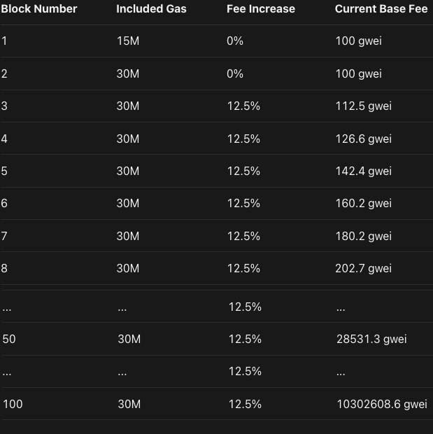

# What is Gas?

The **gas unit** is used to measure the amount of computational effort required to execute a transaction on Ethereum. Since each transaction requires some computation resources to execute, it requires a fee, commonly called Gas fees or Transaction fees.

## Pre-London Upgrade

> `gas fees = gas spent * gas price`

Gas prices are denominated in **Gwei**.
- 1 Gwei = 0.0000000001
- 1 ETH = 10^9 Gwei

> "Gwei stands for Giga-Wei, which is equal to 1,000,000,000 (10^9) wei. Wei is the smallest denomination of ETH. 1 ETH = 10^18 Wei."

****

### Gas Cost Calculations

When a smart contract is compiled into bytecode, before deployment to the Ethereum network, it is compiled down to **OPCODE**. Each OPCODE has a fixed gas cost. [List of OPCODES and their prices.](https://github.com/crytic/evm-opcodes)

**Gas Limit** refers to the maximum amount of gas (units) you're willing to use for the transaction. This is set by the user.

**If your transaction uses less gas than your limit, the unspent gas is refunded to your account.**

**If, however, your transaction uses more gas than your limit, the transaction will fail and your gas will be gone.**

### Block Gas Limit

In addition to user specified gas limits per transaction, the Ethereum network also imposes a limit on the maximum amount of gas (units) allowed in a single block.
This is done so that blocks don't fall out of sync from the rest of the network.

***

## Post-London Upgrade

- Each block has a **base gas price** which minimum price per transaction to include your transaction in this block.
- The base fees would go on to be burnt by the Ethereum network. The burn helps ETH supply reach equilibrium by not inflating it infinitely.
- The concept of **tipping**(_Priority fees_) was introduced. The tip directly goes to the miner of the block. _Higher tip transactions get higher priority._
- The formula for the gas fees changed to:
    > Gas fees = gas spent * (base fees + priority fees)

### Variable Block Sizes

- Variable block sizes were introduced because in times of high demand users had to wait for the demand to reduce to get included in a block.

***
>Q:How the algorithm decides whether a transaction should be >included in that specific block(in pre-London Upgrade) if the >gas price of that transaction is more than 15M? `
>
>A: The transaction will not take place in case the gas goes more than 15M. 15M gas is an insane amount of gas, probably no transaction will be able to consume that much gas. Also 15M gas is equivalent to 750ETH.
***

- Each block now has a target gas limit of **15M**, but the size can increase or decrease along with network demand up until **30M**.
- If the block gas of a block is more than 15M, the base fees of next block is increased, if it is smaller than 15M, the base fees of the next block is decreased.

### Better Gas Estimation

> Maximum Current base fees = (Base of prev. block)*112.5%

This simple formula helps the crypto wallets to calculate maximum gas fees for a transaction easily and with higher accuracy.
***

## Why does Gas Exist?

- It helps keeping the Ethereum network secure.
- Gas limits on transactions helps in avoiding accidental or malicious loops by ending the transaction after 15M gas in a block completely exhausted.
- Using up all of the gas that you send causes your transaction to fail.
- State changes are undone.
- Gas spent are not refunded.
  
***

## Reducing Gas fees

- Ethereum's fundamental goal is to be a **highly secure** and **highly decentralized** blockchain network capable of executing smart contracts which tradesoff the capability of low transaction fees.
- Eth2 addresses some gas issue which will increase transaction per second of the chain.
- Layer 2 Scaling also supporting a lot.
 ***

## Additional Resources

- [An article on reducing Gas Fees](https://medium.com/coinmonks/8-ways-of-reducing-the-gas-consumption-of-your-smart-contracts-9a506b339c0a)
- [An article on Layer 2 Scaling](https://ethereum.org/en/developers/docs/scaling/layer-2-rollups/)
