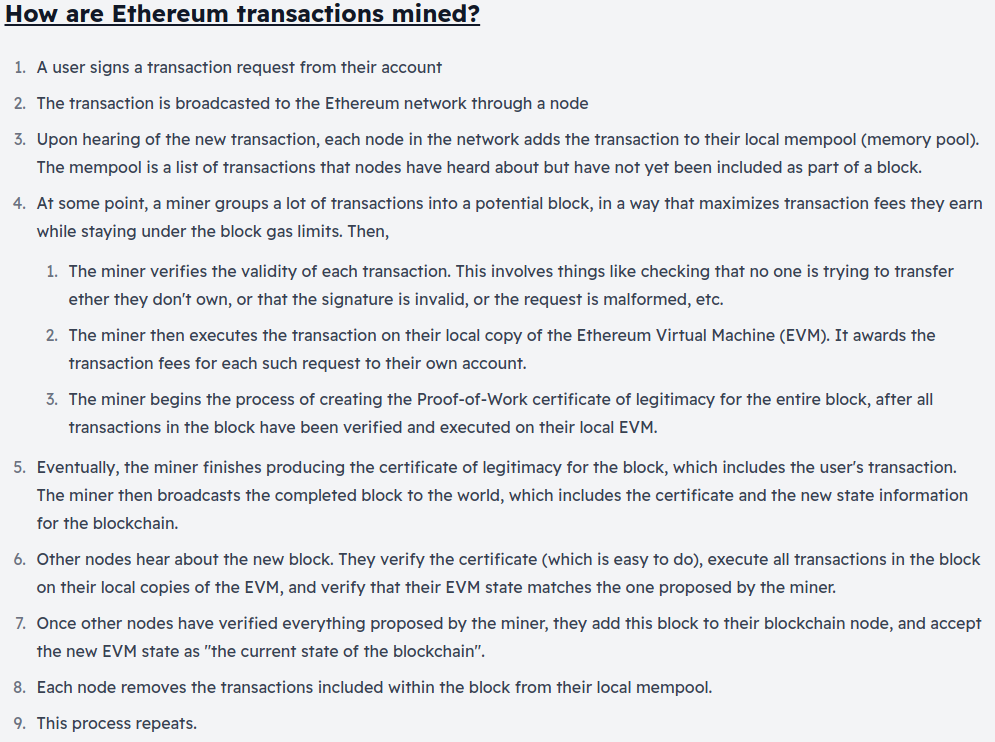

# What is Mining?

Mining is the process that helps create new blocks of transactionsto be added to the Ethereum blockchain network.

Ethereum currently uses a Proof-of-Work (PoW) consensus mechanism, which is heavily reliant on mining. Ethereum miners use their time and computation power to process new incoming transactions and produce new blocks.

>Ethereum 2.0 (scheduled for mid-late 2022) will replace Proof of Work with Proof of Stake, which will significantly change how new blocks are produced. We will talk about Eth2 later.

## Why do miners exist?

- Miners validate cryptocurrency transaction and adding them to the ledger.
- This process prevents **double-spending**.

   > **Double-spending**: It is a ppotential flaw in a digital cash scheme in which the same digital token can be duplicated and can be spent more than once.
***
## Why would anyone become a miner?

- The miners produce a certificate of legitimacy for the proposed block by mining.
- Producing this certificate is computationally hard and complex.
- But, a central authority can easily verify a block and provide certificate.
- When a miner successfully mines a block, they receive 2ETH(newly generated) for their hard work.

***
## Who can become a miner?

- Anyone can become a miner on ethereum.
- But, its unlikely for average computers to mine profitably.

### Costs of Mining
- Cost of hardware and maintenance.
- Electricity
- Other supporting hardwares.

    [ETH Mining Calculator](https://etherscan.io/ether-mining-calculator)
***

***
## Different Methods of Mining

- **CPU-Based**: CPU is used to mine the new block but in today's scenario it would take months to earn even a little mining rewards.
- **GPU-Based**: In this approach, multiple GPU work in parallel to maximise computational power. This is the most common way today?
- **ASIC-Based**: Application-Specific-Integrated-Chip(ASIC) are chips specially designed for Ethereum mining, it is the most popular ways nowadays, but this chips are way expensive. They get obsolete quickly and last for 1-2 years max.
- **Cloud Mining**: Individual miners leverage the ppower of dedicated mining facilities, without owning hardware.
***

## Mining Pools

- A group of miners combine their computational power.
- The mining reward is then distributed among the miners in the pool proportionally to the computational power contribution of each individual.
***
## Resources
- [Visual demo of mining](https://www.youtube.com/watch?v=zcX7OJ-L8XQ)
