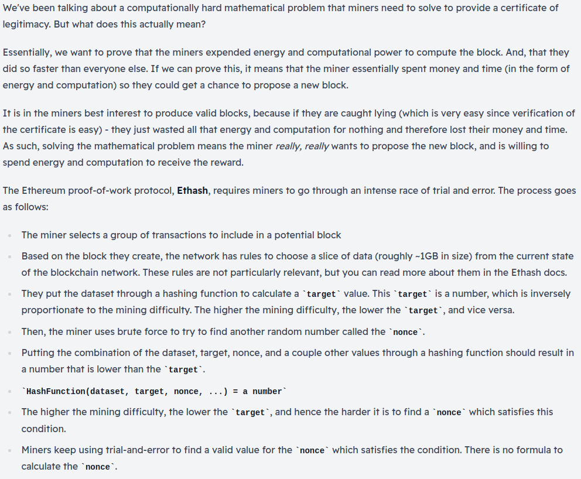

# **What is Proof of Work?**

A consensus protocol called Proof of Work (PoW) allows all nodes on the Ethereum Network to agree on the current state of the blockchain, and secures the network against a variety of attacks.

>**Consensus**: A general agreement about something shared by all the people in a group.

## **What is Consensus Protocol?**

- Consensus protocols help us achieve the agreement, or consensus, on the state of the network at a given point.
- Consensus Protocols are primarily economic systems that work to prevent attacks.

***
## **What is Proof of Work?**

PoW is famously used by Bitcoin and Ethereum Blockchain.

### Block Production

- Miners in the network compete against each other to create new blocks full of processed transactions.
- The winner then shares the block with the rest of the network, and earns freshly _minted_ ETH for their hard work. 

### Network Security

- You need to gain 51% of the network's computational power to control the network.
- However, beacause the mining is incentivised, a lot of miners work hard to earn the incentivise. Thus, it is hard to gain 51% of the network.
- Also if we try to build big infras to control the network, it will take more capital in setup than one could ever earn from it.

***

## **Sybil Resistance**

- PoW is **not** a conensud protocol by itself, it is actually a **Sybil Resistance Mechanism** and **block producer selectors**(a way to decide who is going to be the producer of the latest block).
- **Sybil Resistance** measures how a protocol would do against a **Sybil Attack**.

    >A **Sybil Attack** is the problem when one user or group pretends to be many users.

- Security against this type of attack is essential for a decentralized blockchain to allow miners to be rewarded based on the resources they put in, not just random selection. 
- PoW protects from Sybil attack by making miners solve computational puzzles to make sure they are doing the work. This acts as an economic deterrent to Sybil attacks.
- As the miners get reward proportional to their computational cotribution, thus it no longer matters if you are pretending to be 2 or more.

****

## **Chain Selection Rule**

- When two miners produce valid at the same time, this can cause different nodes in the the network to include different blocks in their blockchain. This phenomenon is called **fork**.
- For blockchain to proceed stably, a single continous chain need to be chosen as the correct chain to prevent the splitting of state.
- BTC & ETH use "Longest Chain Selection Rule" which choses a correct chain which is the longest and continues to grow. Then the forked chain is got ridden of.
- The blocks which form fork chain and end up getting deleted are called **Uncle Blocks**.
- The miner of the uncle block also gets block reward of 1.75ETH because clearly they also have put in the work to validate.

****

## **Finality**

- A transaction has "finality" on Ethereum when it's part of a block that can't change.
- Transactions rejected in the temporary fork may get included in accepted chain. This means that it could get reversed.
- So. finality refers to the time before the transaction becomes irreversible.
- For Ethereum, the recommended time is six blocks or 1 minute.

> ### **Doubts**
>Q: `But to complicate things further, transactions rejected on the temporary fork may have been included in the accepted chain.`  
Why a transaction rejected in forked chain get included in accepted chain? 
>
>A: The miner of the fork may not have included a transaction in that block but maybe the miner of accepted chain will.

****

## **The 'Work' in Proof of Work**

>The mining difficulty becomes less or more difficult based on how many miners are on the network, to ensure that a block can be reliably produced roughly every ~15 seconds. If it becomes too easy and there are a lot of miners, blocks will be produced much faster than 15 seconds. Likewise, if it becomes too hard and there are not a lot of miners, blocks will take a long time to be produced. Difficulty is calculated by the network automatically.
****

## Resources
- [3B1B](https://www.youtube.com/watch?v=bBC-nXj3Ng4)
- [What is Proof of Work? by Binance Academy](https://www.youtube.com/watch?v=3EUAcxhuoU4)

## Doubts
> ### **Doubts** 
>Q: `The attacker submits to the merchant/network a transaction which pays the merchant, while privately mining a blockchain fork in which a double-spending transaction is included instead. After waiting for n confirmations, the merchant sends the product. If the attacker happened to find more than n blocks at this point, he releases his fork and regains his coins; otherwise, he can try to continue extending his fork with the hope of being able to catch up with the network. If he never manages to do this, the attack fails, the payment to the merchant will go through, and the work done mining will also go to waste, as any new bitcoins would be overwritten by the longest chain.` 
What does this mean at the end?  
>
>A: If a merchant accepts a transaction and sends the product to an attacker before waiting an appropriate amonut of time, an attacker who has been mining blocks on a fork can essentialyl 'delete' his earlier transaction which made the payment as his longer fork will be accepted as the 'true' state following the longest chain rule.