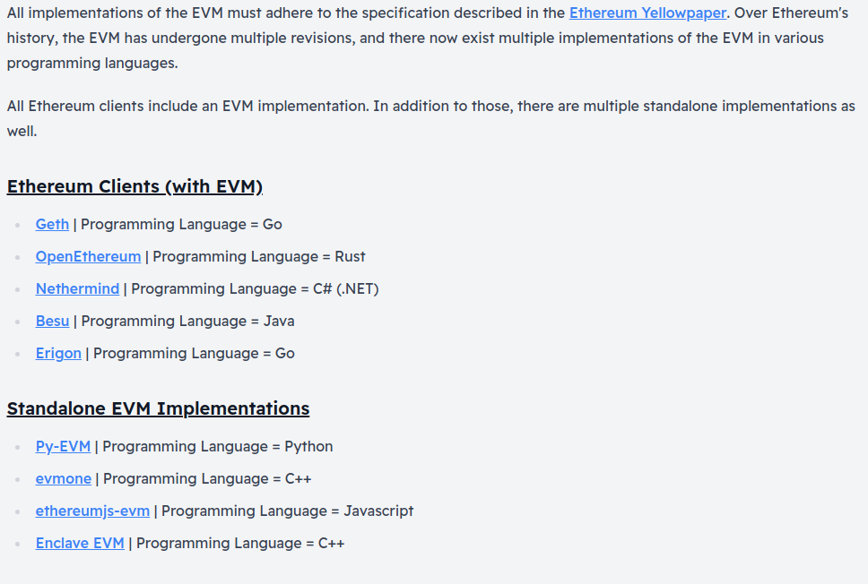

# Ethereum Virtual Machine(EVM)

The Ethereum network exists solely for the purpose of keeping the single, continuous, uninterrupted, and immutable operation of the state machine that is the Ethereum blockchain. It is the environment in which all Ethereum accounts and smart contracts and data live. 

### ***Prerequisites***
- **Bytes**: 1 Byte = 8 bit
- **Memory**: Storage
- **[Stack](https://en.wikipedia.org/wiki/Stack_(abstract_data_type))**:  A Stack is an abstract data type that serves as a collection of elements.
- **[Hash Functions](https://en.wikipedia.org/wiki/Cryptographic_hash_function)**: A mathematical function that maps data of an arbitrary size to a bit array of fixed size.

****

## Ethereum as a State Machine:

- Blockchains like Bitcoin are often described as 'distributed ledgers' which enable the existence of a decentralized currency using fundamental tools of cryptography.
- While Ethereum also has its native cryptocurrency, the Ether, it also enables a much more powerful function that we have seen - Smart Contracts. For this more complex feature, we need a more powerful analogy than just 'distributed ledger'.
- **[State Machine](https://en.wikipedia.org/wiki/Finite-state_machine)**: A state machine is essentially any machine that can change from one state to another in response to certain inputs.

>### **Doubts**
>Q: Explain this image above. 
>A: 
>Q: What do we mean by Program Counter(PC)? 
>A:Basically, a CPU gets instructions from the OS to execute. A program counter is a pointer to a memory location in the CPU saying "this is the next instruction".  
There is a Fetch-Execute cycle happening in the CPU, where at every clock cycle, the next instruction is fetched, the instruction gets executed, and the program counter is incremented. 
Since the EVM behaves as a hardware emulator, it also has a program counter for the solidity code being executed which tells the VM which is the next opcode to execute.
***

## Ethereum State Transition

- On a high level, the EVM behaves similar to a mathematical state transition function.
- The output is same for the same set of input.
- `
   Y(S, T) = S'
   ` 
   Where **S = initial state, T = new transactions, S'= new state**.
- The state in Ethereum is stored as a really large data structure called a _Merkle Patricia Trie_.

***

## EVM Layer

Ethereum nodes contain implementations of the EVM, and the EVM can then execute EVM code on it. 

***

## EVM Code Generation

***

## EVM Instruction (OPCODES)

- The EVM itself behaves as a [stack machine](https://en.wikipedia.org/wiki/Stack_machine) with a maximum depth of 1024 items on the stack. Each item in the stack is a 256-bit (32 bytes) word.
- During execution, the EVM maintains a transient memory, as a 32 byte addressed byte array, which does not persist between transactions. The transient memory is cleared when a new transaction is being executed.
- The smart contracts also maintain a state which is modeled as _Merkel Patricia Trie_

***
## EVM Implementation
 

***

### **Important Resources**
- [Ethereum EVM: Illustrated](https://takenobu-hs.github.io/downloads/ethereum_evm_illustrated.pdf)